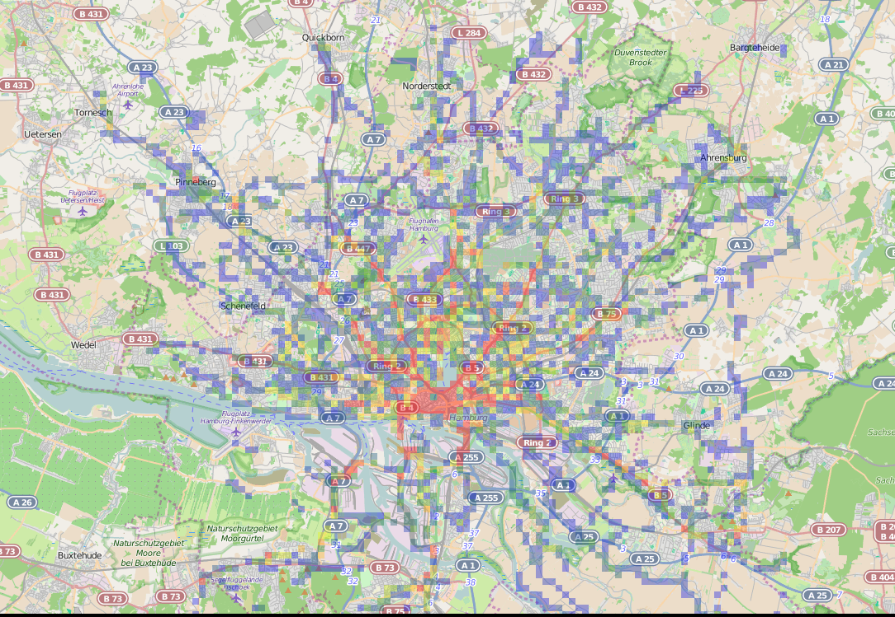
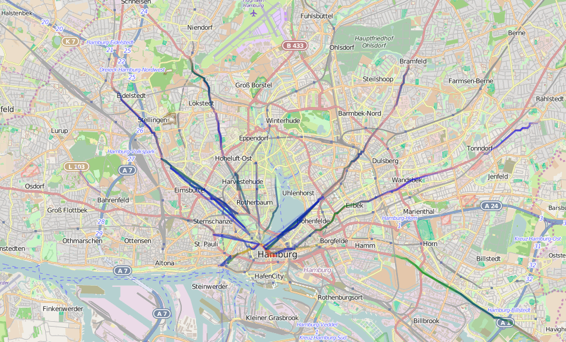

## Real World Advertising Analytics with HDInsight Spark
##### Tim Park, Partner Catalyst Team, Microsoft

One of the biggest challenges of the real world display advertising business is quantifying its impact. Unlike online advertising, with direct measurements like impressions and click thru rates, there are no easy direct measurement techniques for real world advertising. We recently partnered with Ströer, one of the largest display advertisers in Europe, to combine two of their datasets in conjunction with our preview HDInsight Spark data platform into insights around total ad impressions and linkages between their ad frames. 

First, a little background on HDInsight Spark. Spark is a cluster compute framework under incubatation by the Apache Foundation as the successor to the venerable Apache Hadoop project. In contrast to Hadoop, which does most of its data processing operations on-disk, Spark utilizes main memory as much as possible for processing and caching datasets, making it up to 100x faster for some workloads.

Spark also extends the map-reduce paradigm that Hadoop popularized with higher level primitives like sorting, joins, and set operations. This enables it to cover a wider range of workflows that previously had to be implemented as specialized systems built on top of Hadoop.

Microsoft Azure's HDInsight team recently released a preview of a hosted version of Apache Spark that takes all of the pain out of operating a large Spark cluster. Our developer relations team at Microsoft loves to take on projects with new platforms like this and this project was a great way for us to provide valuable feedback to our product teams as they readied this preview.

We used two Ströer Hamburg city level datasets for this analysis: 1) Frame locations (where physical display ads exist) and 2) motion traces of a very large set of anonymous people. We first processed this data was to map all of the frames locations into geographical buckets. This reduces the two dimensional space to a one dimensional geokey that uniquely identifies a particular square geographic region, which makes it much easier to process at scale with Spark's programming model. For this application, we chose geographic regions of 50m on a side to match up with the visual distance that these ads are visible from.

Figure 1: Geobucketed density on Mondays at 10am

We also mapped all of the human motion data to these geokeys. In doing so, we also preserved geokey visit sequences such that we maintained linkage tuples between the geokeys such that we can discover correlations between them. We then joined the frame geokeyed data against the motion geokeyed data to come up with impressions for each of the ad frames.

Finally, we used the linkage tuples to also discover highly linked ad frames:

    >>> sortedConnectionCounts.take(10)

    '4509258-65487_to_4456583-713308': 326
    '4455992-710618_to_4498688-712933': 305
    '4455992-710618_to_4500953-745404': 305
    '4439378-63438_to_4500953-745404': 305
    '4455689-59428_to_4498688-712933': 305
    '4439378-63438_to_4498688-712933': 305
    '4455689-59428_to_4500953-745404': 305
    '4455689-59428_to_4457278-417660': 280
    '4455992-710618_to_4457278-417660': 280
    '4439378-63438_to_4457278-417660': 280
    
This linkage data gives us the insight that anyone seeing ad unit 4509258-65487 is highly likely to also see ad unit 4456583-713308 as they move through the city. This is an insight that Ströer did not previously have and they can use this type of information to potentially build sequential advertising campaigns, or conversely, make sure that they spread the same ad onto the lowest correlated ad frames to maximize exposure.

We can also use this same sort of analysis to find the most common routes through the city by using a similar algorithm on geotiles.

Figure 3: Most popular routes through Hamburg

This is just one example of how you can combine disparate datasets like this to gain real business insights at scale. Apache Spark makes it easy to prototype these solutions to see if they are feasible, runs these workloads faster in production, and HDInsight Spark coupled with Azure Storage makes it easy to operationalize.

For more information, have a look at the <a href="http://spark.apache.org/">Apache Spark project website</a> and <a href="http://azure.microsoft.com/en-us/services/hdinsight/apache-spark">Microsoft Azure's hosted HDInsight Spark.</a> For those of you interested in the nitty gritty technical details, we have also open sourced sample code for this analysis on GitHub at: <a href="http://github.com/timfpark/ad-analytics-spark">http://github.com/timfpark/ad-analytics-spark</a>.
